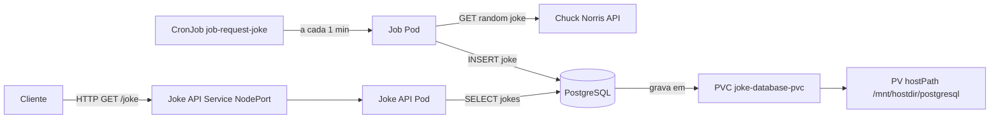

# Joke API no Kubernetes (kind)

Implantação completa da Joke API com PostgreSQL em um cluster Kubernetes local usando [kind](https://kind.sigs.k8s.io/). Inclui Deployments, Services, PersistentVolume, PersistentVolumeClaim, Namespace e CronJob.

## Arquitetura

```
                        ┌──────────────────────────────────┐
                        │         Namespace: jokeapi        │
                        │                                   │
                        │  ┌───────────────┐               │
                        │  │  joke-api     │ Deployment     │
                        │  │  (FastAPI)    │────────────┐  │
                        │  └───────────────┘            │  │
                        │         │                     │  │
                        │  joke-api-svc (NodePort:8000) │  │
                        │                               │  │
                        │  ┌───────────────┐            │  │
                        │  │ joke-database │ Deployment  │  │
                        │  │  (PostgreSQL) │            │  │
                        │  └──────┬────────┘            │  │
                        │         │ PVC → PV (hostPath)  │  │
                        │  joke-database-svc (ClusterIP)│  │
                        │                               │  │
                        │  ┌───────────────┐            │  │
                        │  │ job-request-  │ CronJob    │  │
                        │  │ joke (1/min)  │────────────┘  │
                        │  └───────────────┘               │
                        └──────────────────────────────────┘
```

### Fluxo

1. O **CronJob** `job-request-joke` dispara a cada minuto, busca uma piada aleatória na [Chuck Norris API](https://api.chucknorris.io/) e a grava no PostgreSQL.
2. A **Joke API** serve as piadas armazenadas no banco via endpoint REST.
3. O PostgreSQL persiste os dados em um **PersistentVolume** montado no `hostPath` dos workers (`/mnt/hostdir`).



## Estrutura

```text
06-kubernetes/
├── cluster/
│   ├── config.yaml               # Configuração do cluster kind (1 control-plane + 2 workers)
│   └── create_namespace.yaml     # Namespace jokeapi
├── api/
│   ├── api_deployment.yaml       # Deployment da Joke API
│   ├── api_service.yaml          # Service NodePort para a API
│   ├── Dockerfile
│   ├── requirements.txt
│   └── src/main.py
├── postgres/
│   ├── database_deployment.yaml  # Deployment do PostgreSQL
│   ├── database_pv_pvc.yaml      # PersistentVolume + PersistentVolumeClaim
│   └── database_service.yaml     # Service ClusterIP para o banco
├── job/
│   ├── job_request_new_joke.yaml # CronJob (disparo a cada minuto)
│   ├── Dockerfile
│   ├── requirements.txt
│   └── src/main.py
└── hostdir/                      # Montado nos workers via kind extraMounts
```

## Pré-requisitos

- [Docker](https://docs.docker.com/get-docker/)
- [kind](https://kind.sigs.k8s.io/docs/user/quick-start/#installation)
- [kubectl](https://kubernetes.io/docs/tasks/tools/)

## Como executar

### 0. Ajustar o path local no config do cluster

Antes de criar o cluster, ajuste o `hostPath` em `cluster/config.yaml` para o caminho local deste projeto na sua maquina.

Exemplo:

```yaml
extraMounts:
    - hostPath: /seu/caminho/06-kubernetes/hostdir
        containerPath: /mnt/hostdir
```

### 1. Criar o cluster kind

```bash
kind create cluster --config cluster/config.yaml --name jokeapi-cluster
```

### 2. Criar o Namespace

```bash
kubectl apply -f cluster/create_namespace.yaml
```

### 3. Criar PersistentVolume e PVC

```bash
kubectl apply -f postgres/database_pv_pvc.yaml
```

### 4. Subir o PostgreSQL

```bash
kubectl apply -f postgres/database_deployment.yaml
kubectl apply -f postgres/database_service.yaml
```

### 5. Subir a API

```bash
kubectl apply -f api/api_deployment.yaml
kubectl apply -f api/api_service.yaml
```

### 6. Criar o CronJob

```bash
kubectl apply -f job/job_request_new_joke.yaml
```

### 7. Verificar os recursos

```bash
kubectl get all -n jokeapi
kubectl get pv,pvc -n jokeapi
```

### 8. Acessar a API

```bash
# Obter a porta NodePort alocada
kubectl get svc joke-api-svc -n jokeapi

# Obter o IP de um worker
kubectl get nodes -o wide

# Fazer uma requisição
curl http://<NODE_IP>:<NODE_PORT>/joke/
```

### Limpar tudo

```bash
kind delete cluster --name jokeapi-cluster
```

## Comandos mais usados no Kubernetes

### Contexto e namespace

```bash
# Ver contexto atual do kubectl
kubectl config current-context

# Listar contexts
kubectl config get-contexts

# Definir namespace padrao para o contexto atual
kubectl config set-context --current --namespace=jokeapi
```

### Recursos principais

```bash
# Ver tudo no namespace
kubectl get all -n jokeapi

# Ver pods com mais detalhes
kubectl get pods -n jokeapi -o wide

# Acompanhar mudancas em tempo real
kubectl get pods -n jokeapi -w

# Ver services, deployments e jobs
kubectl get svc,deploy,job,cronjob -n jokeapi
```

### Logs e diagnostico

```bash
# Logs de um deployment (stream)
kubectl logs -f deployment/joke-api -n jokeapi

# Logs do postgres
kubectl logs -f deployment/joke-database -n jokeapi

# Descrever pod (eventos, erros, probes, etc.)
kubectl describe pod <POD_NAME> -n jokeapi

# Ver eventos recentes do namespace
kubectl get events -n jokeapi --sort-by=.metadata.creationTimestamp
```

### Aplicar mudancas

```bash
# Aplicar um manifesto
kubectl apply -f api/api_deployment.yaml

# Reaplicar tudo por pasta
kubectl apply -f api/

# Ver diff antes de aplicar
kubectl diff -f api/
```

### Reinicio e escala

```bash
# Reiniciar rollout da API
kubectl rollout restart deployment/joke-api -n jokeapi

# Ver status do rollout
kubectl rollout status deployment/joke-api -n jokeapi

# Escalar replicas da API
kubectl scale deployment/joke-api --replicas=2 -n jokeapi
```

### Executar comandos dentro do pod

```bash
# Abrir shell em um pod
kubectl exec -it <POD_NAME> -n jokeapi -- sh

# Testar conexao com a API a partir de um pod temporario
kubectl run curltmp --rm -it --restart=Never -n jokeapi --image=curlimages/curl -- \
    curl -s http://joke-api-svc:8000/joke/
```

### Port-forward (acesso local rapido)

```bash
# Expor a API localmente em localhost:8000
kubectl port-forward -n jokeapi svc/joke-api-svc 8000:8000

# Em outro terminal
curl http://127.0.0.1:8000/joke/
```

### Limpeza de recursos

```bash
# Deletar um recurso especifico
kubectl delete -f job/job_request_new_joke.yaml

# Deletar todos os recursos de uma pasta
kubectl delete -f api/

# Deletar namespace inteiro (remove tudo dentro)
kubectl delete namespace jokeapi
```

## Manifests resumidos

| Arquivo | Recurso | Descrição |
|---|---|---|
| `cluster/config.yaml` | Cluster kind | 1 control-plane + 2 workers com hostPath mount |
| `cluster/create_namespace.yaml` | Namespace | `jokeapi` |
| `postgres/database_pv_pvc.yaml` | PV + PVC | 1Gi, `storageClassName: manual`, `ReadWriteMany` |
| `postgres/database_deployment.yaml` | Deployment | PostgreSQL 16, credenciais via env |
| `postgres/database_service.yaml` | Service | ClusterIP, porta 5432 |
| `api/api_deployment.yaml` | Deployment | Joke API FastAPI, 1 réplica |
| `api/api_service.yaml` | Service | NodePort, porta 8000 |
| `job/job_request_new_joke.yaml` | CronJob | Executa a cada minuto, busca piada e grava no banco |

## Observações

- As credenciais do banco (`admin123`) estão hardcoded nos manifests por ser um ambiente de estudo. Em produção, use **Kubernetes Secrets**.
- O `hostPath` do PV aponta para `/mnt/hostdir/postgresql`, que é montado nos workers via `extraMounts` no `config.yaml` do kind.
- O CronJob mantém no máximo 2 execuções bem-sucedidas e 2 com falha no histórico (`successfulJobsHistoryLimit: 2`, `failedJobsHistoryLimit: 2`).
